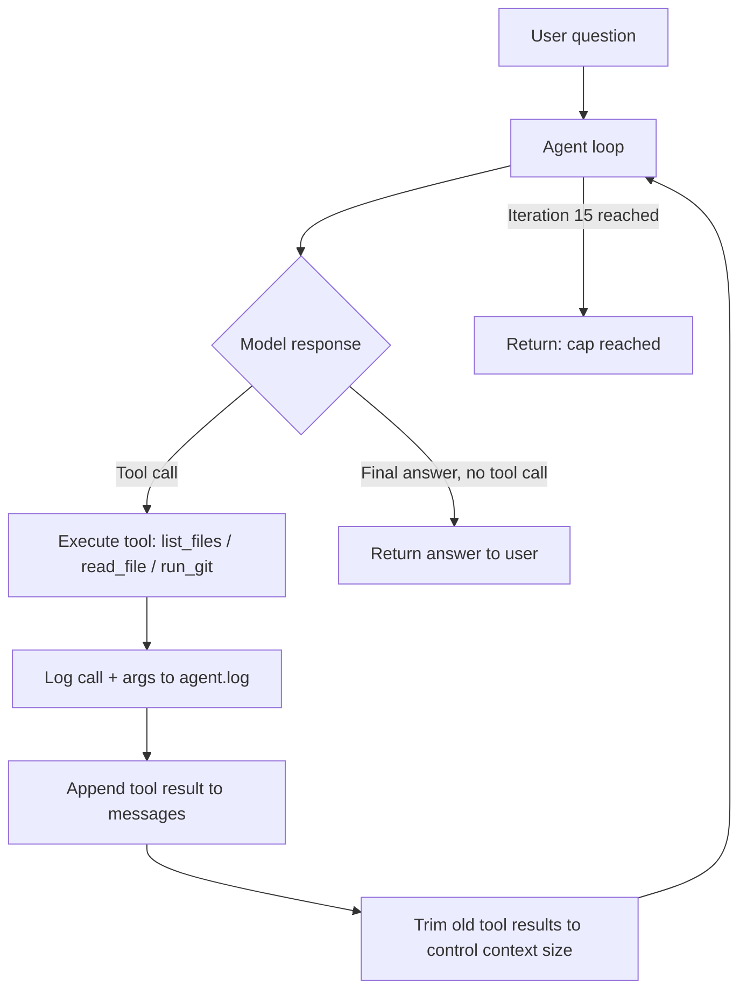

# Coding Research Agent

An agent, built from scratch (no LangChain/LangGraph/CrewAI), that clones a GitHub repo and
answers natural-language questions about its architecture using tool calling.

## How it works

The agent runs a simple loop: send the conversation to the model with a fixed set of tools,
execute whatever tool calls come back, feed the results into the conversation, repeat — capped
at 15 iterations. There's no framework underneath any of this; the loop, the tool dispatch, and
the context management are all plain Python.



## Tools available to the agent

- **`list_files`** — lists files under a directory in the cloned repo
- **`read_file`** — reads a file's contents; refuses files over 100KB and known binary extensions
- **`run_git`** — runs a read-only git command, restricted to a fixed allowlist (`log`, `ls-files`, `show`)

Every tool call is logged with its full arguments to `agent.log`. Tool output is capped at 3KB
per call, with older tool results in a long conversation replaced by a placeholder so context
doesn't grow unbounded across iterations.

## Setup

```bash
git clone https://github.com/Samay8/coding-research-agent.git
cd coding-research-agent
python -m venv venv
.\venv\Scripts\Activate.ps1        # Windows; source venv/bin/activate on Mac/Linux
python -m pip install -r requirements.txt
```

Create a `.env` file:
```
GROQ_API_KEY=your-key-here
```

Get a free key at [console.groq.com](https://console.groq.com) — no credit card required.

## Usage

```bash
python agent.py <github-repo-url> "<your question>"
```

## Worked examples

### Example 1
**Repo:** `Samay8/credit-risk-service`
**Question:** What does the /predict endpoint do and what does it log?
**Agent trace:** `list_files` → `read_file(app/main.py)` → `read_file(app/model.py)` → `read_file(app/logging_config.py)` — 4 iterations
**Answer:** The endpoint accepts a `CreditApplication`, builds a DataFrame, runs it through the
loaded RandomForest model via `predict_proba`, derives a `high_risk`/`low_risk` label at a 0.5
threshold, and returns both alongside the probability. It logs a single structured JSON entry
per prediction containing `duration`, `credit_amount`, `purpose`, `risk_probability`,
`risk_label`, and `latency_ms` — critically, `personal_status_sex` (the one sensitive field) is
never logged raw, only as a truncated SHA-256 hash (`personal_status_sex_hash`).

### Example 2
**Repo:** `Samay8/domain-rag-chatbot`
**Question:** How does the app decide when to refuse a question as out-of-scope?
**Agent trace:** `list_files` → `read_file(app.py)` → `read_file(rag.py)` (in 3 chunks) → re-checked `app.py` — 6 iterations
**Answer:** The guard lives in `rag.py`'s `answer_question()`. After retrieving the top-k chunks
from Chroma, it checks the minimum similarity distance against `RELEVANCE_THRESHOLD = 0.6` —
if even the closest match exceeds that threshold, the function returns a fixed refusal message
and an empty source list instead of calling the LLM at all.

### Example 3
**Repo:** `pandas-dev/pandas`
**Question:** What's in the largest file in the codebase?
**Agent trace:** 15 iterations across `list_files`, `read_file`, and `run_git`, exploring
benchmarks, test data, and `_libs/src` — never reached a definitive answer
**Answer:** *Reached the 15-iteration cap without a final answer.*
**Why this is included:** The agent has no direct way to check file sizes without reading full
file contents one at a time, and pandas is a large enough codebase that this approach doesn't
converge in 15 iterations. This is the iteration cap working exactly as intended — it stops the
agent from looping indefinitely on a question its toolset isn't well-suited to answer, rather
than burning tokens forever. A `get_largest_files` tool would close this gap; left out of this
version to keep the toolset intentionally small.

## Safety constraints

- **File size limit:** `read_file` refuses anything over 100KB outright — no partial reads of
  minified bundles or generated files that would burn tokens for no value.
- **Binary file rejection:** known binary extensions (`.pdf`, `.png`, images, archives, compiled
  files) are refused before ever attempting to read them as text.
- **Git command allowlist:** `run_git` only executes `log`, `ls-files`, or `show` — any other
  subcommand is rejected inside the tool itself, not left to the model's judgment.
- **No shell access beyond git:** there is no general-purpose shell/exec tool anywhere in this
  project.

## Reflection

Building the loop by hand made it obvious how much a framework like LangChain is really doing
under the hood — context trimming, tool dispatch, and iteration limits all had to be written
explicitly here, and each one caught a real bug during development (a Windows encoding crash on
binary git output, a rate-limit hit from unbounded context growth, a mixed dict/pydantic message
list breaking a naive `.get()` call). The 15-iteration cap in particular proved its worth on the
pandas example — a real question with no clean answer given the current toolset, stopped
cleanly instead of looping.

## Tech used

Groq API (OpenAI-compatible client, `openai/gpt-oss-120b`), tool calling, agent loops, CLI design (argparse)

## Project structure

```
coding-research-agent/
├── tools/
│   ├── filesystem.py
│   └── git_tools.py
├── agent.py
├── requirements.txt
└── README.md
```
